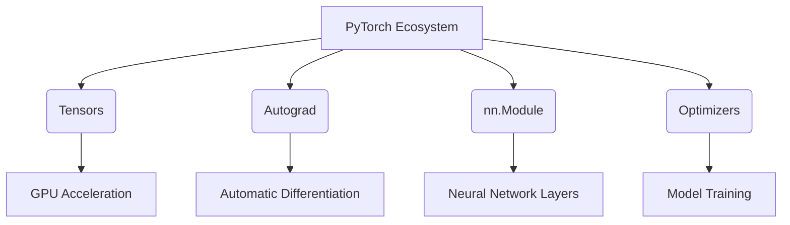

# PyTorch for Beginners

## Overview
- **Dynamic Computational Graphs**: PyTorch uses dynamic graphs (define-by-run), making it intuitive and easy to debug.
- **Python-First Approach**: It is deeply integrated with Python, allowing the use of standard Python debuggers and tools.
- **Tensors**: The core data structure, similar to NumPy arrays but with GPU acceleration support.

## Architecture & Components

## Recommended Resources
- [Deep Learning with PyTorch: A 60 Minute Blitz](https://pytorch.org/tutorials/beginner/deep_learning_60min_blitz.html) - Official beginner tutorial.
- [PyTorch Basics by Machine Learning Mastery](https://machinelearningmastery.com/pytorch-tutorial-develop-deep-learning-models/) - A great practical introduction.
