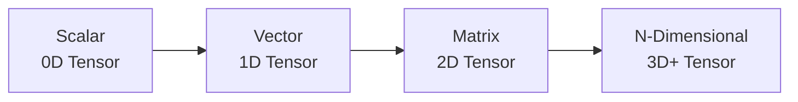

# Tensors in PyTorch

## Overview
- **What are Tensors?**: Multi-dimensional arrays used as the fundamental data structure in PyTorch.
- **Operations & Broadcasting**: Supports a vast array of mathematical operations, including matrix multiplication and automatic broadcasting.
- **Device Placement**: Tensors can easily be moved between CPU and GPU for hardware-accelerated computing.

## Tensor Dimensionality

## Recommended Resources
- [Official PyTorch Tensors Tutorial](https://pytorch.org/tutorials/beginner/basics/tensorqs_tutorial.html) - Comprehensive guide on creating and manipulating tensors.
- [Understanding PyTorch Tensors (Towards Data Science)](https://towardsdatascience.com/understanding-pytorch-tensors-2a91176b92dc) - In-depth article on tensor internals.
