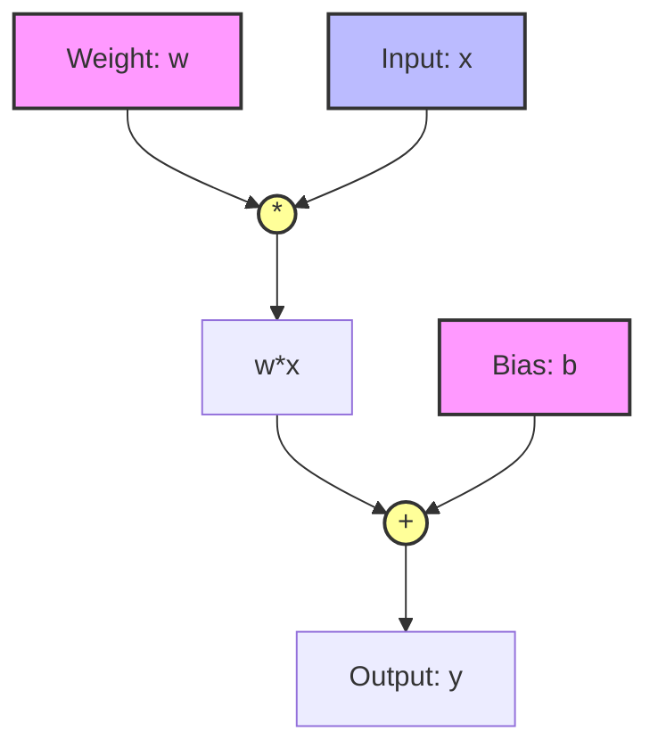

# PyTorch Autograd

## Overview
- **Automatic Differentiation**: `torch.autograd` is PyTorch's automatic differentiation engine that powers neural network training.
- **The `requires_grad` Flag**: Setting this to `True` tells PyTorch to track all operations performed on the tensor to compute gradients later.
- **Forward & Backward Passes**: The forward pass computes the output, while `.backward()` computes the gradients of the loss w.r.t the parameters.

## Computational Graph

## Recommended Resources
- [A Gentle Introduction to torch.autograd](https://pytorch.org/tutorials/beginner/blitz/autograd_tutorial.html) - Official tutorial on PyTorch's autograd engine.
- [PyTorch Autograd Explained](https://towardsdatascience.com/pytorch-autograd-understanding-the-heart-of-pytorchs-magic-2686cd94ec95) - detailed walkthrough.
