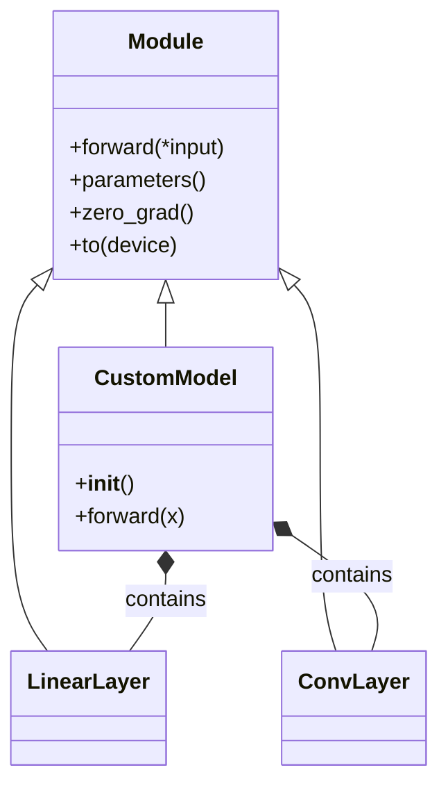

# PyTorch nn.Module

## Overview
- **The Base Class**: `nn.Module` is the base class for all neural network modules in PyTorch. Your models should subclass it.
- **Initialization**: Layers and parameters are defined in the `__init__` method.
- **Forward Method**: The `forward` method defines the computation performed at every call. You do not explicitly call `forward()`, but rather pass data to the model instance (e.g., `model(inputs)`).

## Class Architecture

## Recommended Resources
- [Building Neural Networks with nn.Module](https://pytorch.org/tutorials/beginner/basics/buildmodel_tutorial.html) - PyTorch basics tutorial.
- [PyTorch nn.Module Documentation](https://pytorch.org/docs/stable/generated/torch.nn.Module.html) - API reference.
