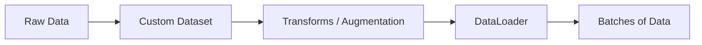

# PyTorch Dataset and DataLoader

## Overview
- **Dataset Class**: The `torch.utils.data.Dataset` is an abstract class representing a dataset. You override `__len__` and `__getitem__` to load custom data.
- **DataLoader Class**: Wraps an iterable around the Dataset to enable easy access to the samples. It provides batching, shuffling, and multi-process data loading.
- **Transforms**: Operations applied to data before returning it, like converting images to tensors or normalizing.

## Data Processing Flow

## Recommended Resources
- [Datasets & DataLoaders (PyTorch Official)](https://pytorch.org/tutorials/beginner/basics/data_tutorial.html) - Official guide on loading data.
- [A Detailed Guide to PyTorch's DataLoader](https://towardsdatascience.com/a-detailed-guide-to-pytorchs-dataloader-7a1a46b3f6fb) - In-depth exploration of data loading mechanisms.
