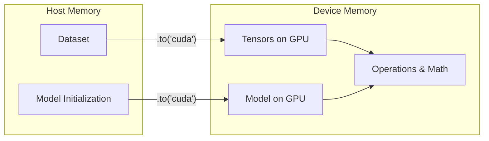

# Training on GPU in PyTorch

## Overview
- **CUDA Tensors**: PyTorch supports NVIDIA's CUDA to perform tensor operations on the GPU, massively accelerating training.
- **Device Placement**: You must explicitly move both your model and your data to the GPU using `.to('cuda')`.
- **Data Transfer Overhead**: Moving data between CPU and GPU is slow, so minimize the number of transfers.

## CPU to GPU Transfer

## Recommended Resources
- [CUDA Semantics (PyTorch Official)](https://pytorch.org/docs/stable/notes/cuda.html) - Detailed notes on using CUDA with PyTorch.
- [How to move PyTorch model and data to GPU](https://stackoverflow.com/questions/59013109/how-to-move-pytorch-model-and-data-to-gpu) - Common patterns and best practices.
