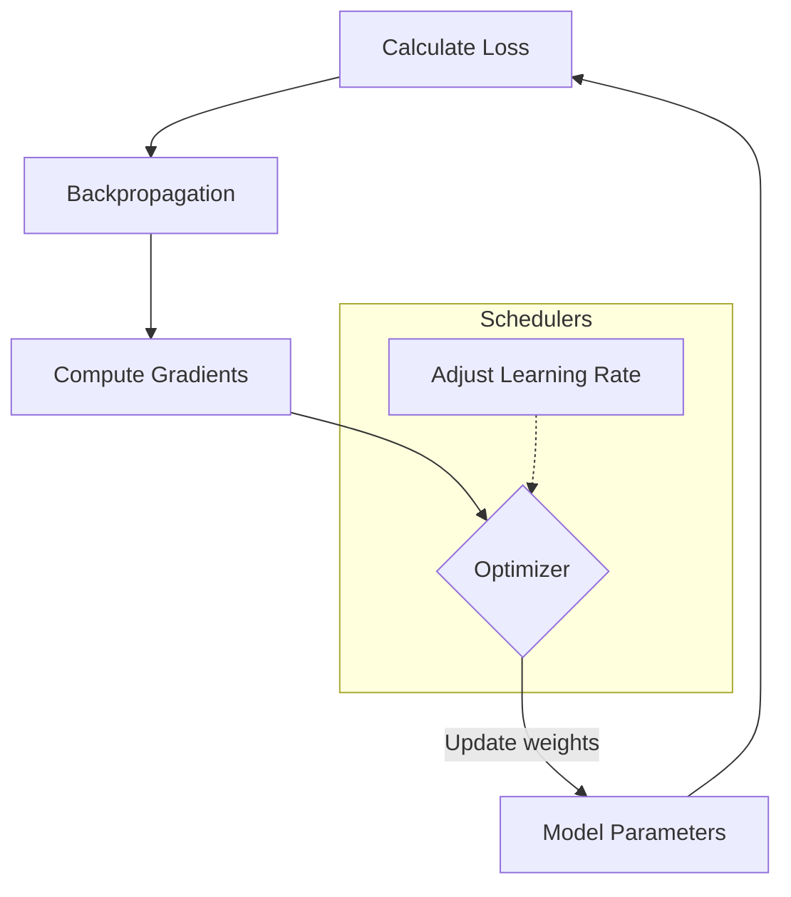

# Optimizing the Neural Network

## Overview
- **Optimizers**: Algorithms like SGD, Adam, and RMSprop that update the model's weights based on the computed gradients to minimize the loss.
- **Learning Rate Scheduling**: Dynamically adjusting the learning rate during training (e.g., `StepLR`, `ReduceLROnPlateau`) to achieve better convergence.
- **Weight Decay**: Adding an L2 penalty to the loss function to prevent overfitting.

## Optimization Process

## Recommended Resources
- [torch.optim Documentation](https://pytorch.org/docs/stable/optim.html) - PyTorch's comprehensive guide on optimizers.
- [An overview of gradient descent optimization algorithms](https://ruder.io/optimizing-gradient-descent/) - Sebastian Ruder's excellent blog post on optimization.
