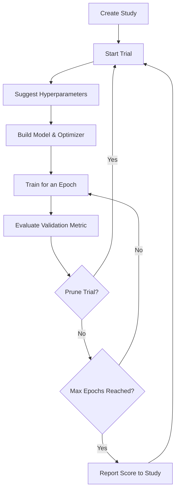

# Optuna x PyTorch

## Overview
- **Hyperparameter Tuning**: Finding the optimal set of hyperparameters (e.g., learning rate, batch size, number of layers) to maximize model performance.
- **Optuna**: An open-source hyperparameter optimization framework that automates the trial-and-error process.
- **Pruning**: Optuna can early-stop unpromising trials using techniques like Successive Halving to save computational resources.

## Optuna Workflow

## Recommended Resources
- [Optuna PyTorch Integration Guide](https://optuna.org/design/pytorch/) - Official Optuna guide for PyTorch.
- [Hyperparameter Tuning with Optuna in PyTorch](https://towardsdatascience.com/hyperparameter-tuning-of-neural-networks-with-optuna-and-pytorch-22e179efc837) - Hands-on tutorial.
