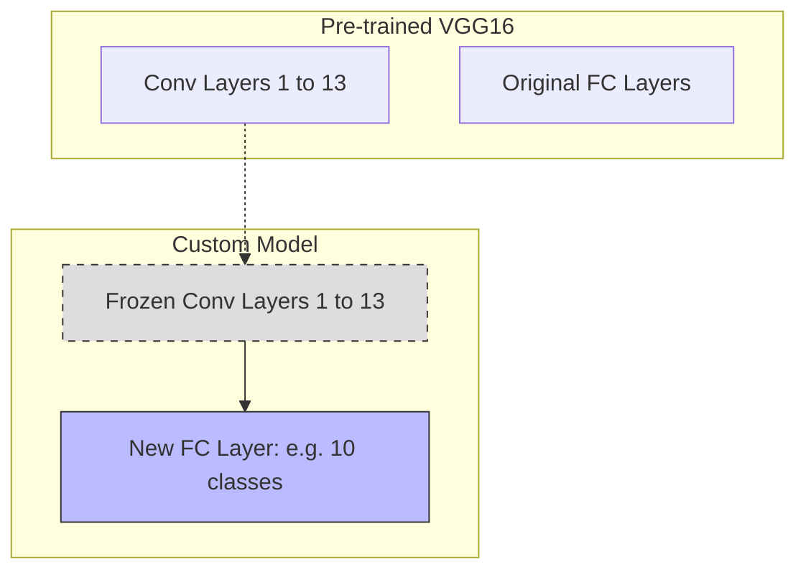

# Transfer Learning (VGG16)

## Overview
- **Transfer Learning**: Utilizing a model trained on a large dataset (like ImageNet) for a different but related task to save time and compute.
- **VGG16**: A classic deep CNN architecture available in `torchvision.models`.
- **Fine-Tuning vs Feature Extraction**:
  - *Feature Extraction*: Freeze all base layers, only train the final classification head.
  - *Fine-Tuning*: Unfreeze the entire network and train with a very small learning rate.

## Transfer Learning Process

## Recommended Resources
- [Transfer Learning for Computer Vision Tutorial](https://pytorch.org/tutorials/beginner/transfer_learning_tutorial.html) - Official PyTorch tutorial on transfer learning.
- [VGG16 Architecture Explained](https://neurohive.io/en/popular-networks/vgg16/) - Detailed look at the VGG16 network.
