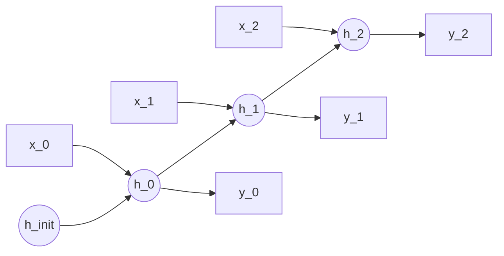

# RNN using PyTorch

## Overview
- **Recurrent Neural Networks**: Designed to process sequential data (time series, text) by maintaining a hidden state that captures information from previous time steps.
- **`nn.RNN`**: PyTorch provides the base RNN module, taking inputs shaped `(sequence_length, batch_size, input_size)`.
- **Vanishing Gradients**: Standard RNNs struggle with long sequences due to vanishing or exploding gradients.

## Unrolled RNN Architecture

## Recommended Resources
- [NLP From Scratch: Classifying Names with a Character-Level RNN](https://pytorch.org/tutorials/intermediate/char_rnn_classification_tutorial.html) - PyTorch intermediate tutorial.
- [Understanding Recurrent Neural Networks](https://towardsdatascience.com/understanding-rnn-and-lstm-f7cdf6dfc14e) - High-level conceptual overview.
